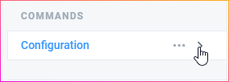

# Configuration

⚙ These are the configuration commands, make sure you expand the category as shown in the image to check them all.  

⚙ You can also check this list of all the configuration commands and click on them to go to the command page:

* [Export](export.md)
* [Import](import.md)

